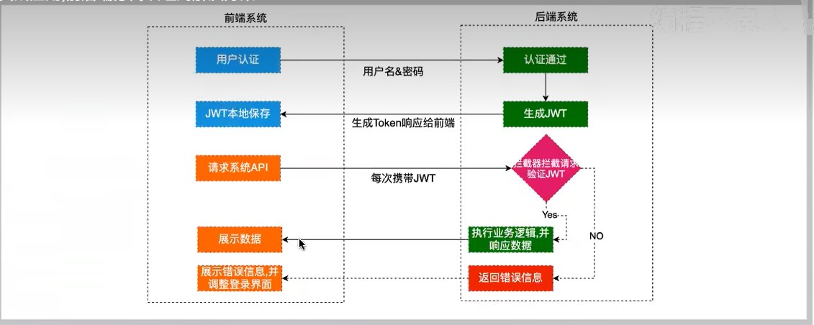

## 什么是JWT
[官网](https://www.jwt.io/introduction#what-is-json-web-token) 
JSON Web Token (JWT) is an open standard (RFC 7519) that defines a compact and self-contained way for securely transmitting information between parties as a JSON object. This information can be verified and trusted because it is digitally signed. JWTs can be signed using a secret (with the HMAC algorithm) or a public/private key pair using RSA or ECDSA.

Although JWTs can be encrypted to also provide secrecy between parties, we will focus on signed tokens. Signed tokens can verify the integrity of the claims contained within it, while encrypted tokens hide those claims from other parties. When tokens are signed using public/private key pairs, the signature also certifies that only the party holding the private key is the one that signed it.
## JWT能做什么
Here are some scenarios where JSON Web Tokens are useful:

- Authorization: This is the most common scenario for using JWT. Once the user is logged in, each subsequent request will include the JWT, allowing the user to access routes, services, and resources that are permitted with that token. Single Sign On is a feature that widely uses JWT nowadays because of its small overhead and its ability to be easily used across different domains. 
- Information Exchange: JSON Web Tokens are a good way of securely transmitting information between parties. Because JWTs can be signed—for example, using public/private key pairs—you can be sure the senders are who they say they are. Additionally, as the signature is calculated using the header and the payload, you can also verify that the content hasn't been tampered with.

## 为什么是JWT
### 基于传统的session认证
- 每个用户经过我们的应用认证之后，我们的应用都要在服务端做一次记录，以方便用户下次请求的鉴别，通常而言session都是保存在内存中，而随着认证用户的增多，服务端的开销会明显增大
- 用户认证之后，服务端做认证记录，如果认证的记录被保存在内存中的话，这意味着用户下次请求还必须要请求在这台服务器上,这样才能拿到授权的资源，这样在分布式的应用上，相应的限制了负载均衡器的能力。这也意味着限制了应用的扩展能力。
- 因为是基于cookie来进行用户识别的，cookie如果被截获，用户就会很容易受到跨站请求伪造的攻击。
- 在前后端分离系统中就更加痛苦:如下图所示也就是说前后端分离在应用解耦后增加了部署的复杂性。通常用户一次请求就要转发多次。如果用session 每次携带sessionid 到服务器，服务器还要查询用户信息。同时如果用户很多。这些信息存储在服务器内存中，给服务器增加负担。还有就是CSRF(跨站伪造请求攻击)攻击，session是基于cookie进行用户识别的，cookie如果被截获，用户就会很容易受到跨站请求伪造的攻击。还有就是sessionid就是一个特征值，表达的信息不够丰富。不容易扩展。而且如果你后端应用是多节点部署。那么就需要实现session共享机制。不方便集群应用。

### 基于JWT认证

1. 认证流程

	- 前端通过Web表单将自己的用户名和密码发送到后端的接口。这一过程一般是一个HTTP POST请求。建议的方式是通过SSL加密的传输(https协议)，从而避免敏感信息被嗅探。
	- 后端核对用户名和密码成功后，将用户的id等其他信息作为JWT Payload(负载)，将其与头部分别进行Base64编码拼接后签名，形成3-个JWT(Token)。形成的JWT就是一个形同111,zzz,xxx的字符串。 token head,payload.singurater
	- 后端将JWT字符串作为登录成功的返回结果返回给前端。前端可以将返回的结果保存在1ocalStorage或sessionstorage上，退出登录时前端删除保存的JWT即可。
	- 前端在每次请求时将JWT放入HTTP Header中的Authorization位。(解决XSS和XSRF问题)
	- 后端检查是否存在，如存在验证JWT的有效性。例如，检查签名是否正确;检查Token是否过期;检查Token的接收方是否是自己
	- 验证通过后后端使用JWT中包浛的用户信息进行其他逻辑操作，返回相应结果。
2. JWT优势

	- 简洁(Compact): 可以通过URL，POST参数或者在HTTP header发送，因为数据量小，传输速度也很快
	- 自包含(Self-contained):负载中包含了所有用户所需要的信息，避免了多次查询数据库
	- 因为Token是以JSON加密的形式保存在客户端的，所以JWT是跨语言的，原则上任何web形式都支持，
	- 不需要在服务端保存会话信息，特别适用于分布式微服务。

